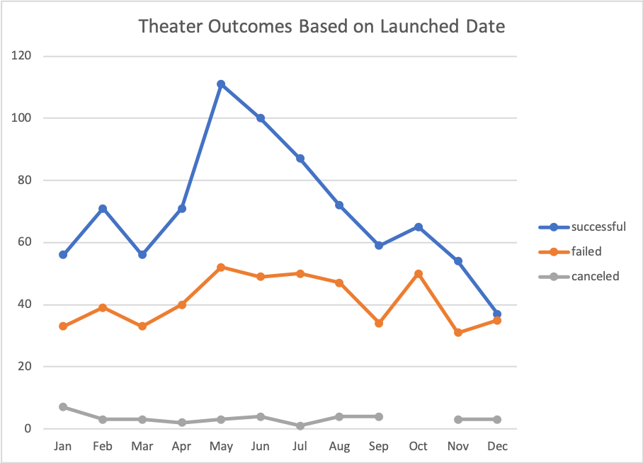
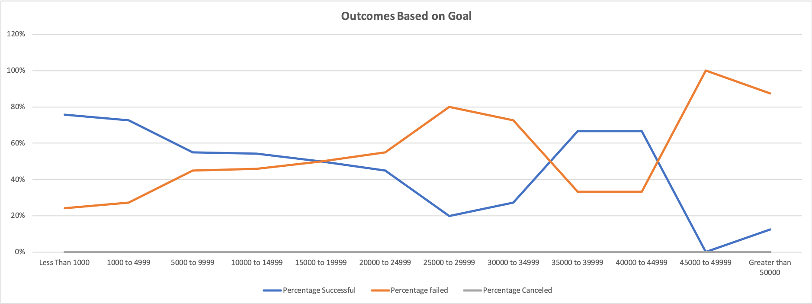
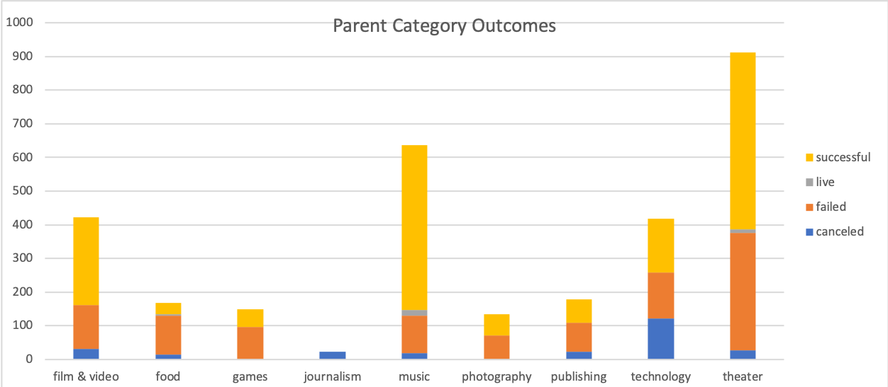

# Kickstarter Analysis

## Overview

Analyzed a dataset consisting of 4,000 crowdfunding projects to discover hidden trends. For this challenge, two new analysis were created in addition to the module work: outcomes based on goals and outcomes based on launch date.

## Purpose

- Import data into table analysis
- Apply filters, conditional formatting, and formulas
- Generate and interpret pivot tables
- Calculate summary statistics (measures of central tendency, standard deviation, and variance)
- Identify outliers in datasets
- Perform an Excel analysis with visualizations

## Results

#### Category Stats Pivot (US Filter) 

